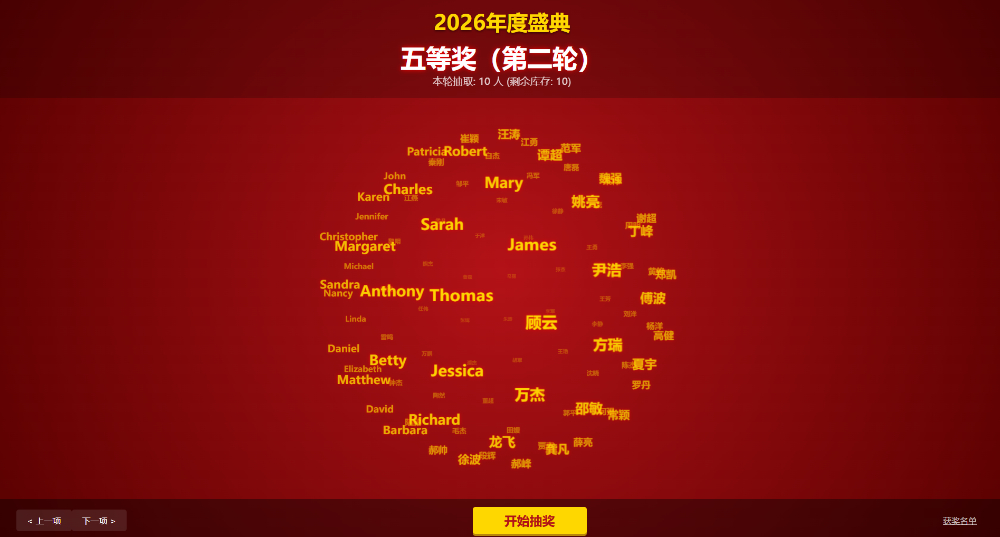

# 祝我年会中一等奖

<div align="center">


一款为年会抽奖设计的 3D 滚动抽奖系统

</div>

---

## 项目简介

**祝我年会中一等奖** 是一款专为年会、庆典等场合设计的 3D 抽奖系统。通过炫酷的 3D 名字云滚动效果，让抽奖过程充满仪式感和期待感。



### 适用场景

- 公司年会抽奖
- 节日庆典活动
- 线上直播抽奖
- 团队建设活动

---

## 功能特点

### 核心功能

| 功能 | 说明 |
|------|------|
| 3D 名字云 | 使用 CSS3 3D 变换实现球形名字云旋转效果 |
| 多奖项支持 | 支持配置多个奖项等级及中奖名额 |
| 分组抽奖 | 支持按组别抽取，灵活控制参与范围 |
| 去重抽取 | 已中奖人员自动排除，确保不重复中奖 |
| 键盘控制 | 空格键快捷开始/停止抽奖 |
| 数据持久化 | 中奖记录实时保存到本地文件 |

### 界面特色

- 红金配色主题，营造喜庆氛围
- 金色发光文字效果
- 径向渐变背景
- 获奖名单侧边栏展示
- 流畅的动画过渡

---

## 技术栈

```
前端层
├── Vue 3.4+        - 渐进式前端框架
├── Vite 5.0+       - 下一代前端构建工具
└── Sass            - CSS 预处理器

后端层
├── Express 4.18+   - Web 应用框架
├── Node.js         - 运行时环境
└── JSON 文件       - 轻量级数据存储

3D 效果
└── CSS3 3D Transforms - 原生 3D 变换
```

---

## 快速开始

### 环境要求

- Node.js >= 16.0.0
- npm >= 8.0.0

### 安装依赖

```bash
npm install
```

### 开发模式

启动开发服务器（前端 :5173，后端 :3000）：

```bash
# 终端 1 - 启动后端服务
npm run start

# 终端 2 - 启动前端开发服务
npm run dev
```

### 生产构建

```bash
# 构建前端资源
npm run build

# 启动生产服务
npm run start
```

---

## 使用说明

### 基本操作

| 操作 | 方式 |
|------|------|
| 开始抽奖 | 点击「开始抽奖」按钮 |
| 停止抽奖 | 点击「停止」或按空格键 |
| 切换奖项 | 点击「上一项」/「下一项」 |
| 查看名单 | 点击右侧「中奖名单」展开 |
| 重置数据 | 点击右上角「重置」按钮 |

### 抽奖流程

1. 选择当前抽取的奖项
2. 点击「开始抽奖」，名字云加速旋转
3. 点击「停止」，系统随机抽取中奖者
4. 中奖名单自动记录并保存
5. 重复以上步骤直至所有奖项抽取完毕

---

## 配置说明

### 奖项配置

编辑 `database.json` 文件中的 `prizes` 字段：

```json
{
  "prizes": [
    {
      "id": 1,
      "name": "一等奖",
      "count": 1,
      "groups": ["A", "B"]
    }
  ]
}
```

| 参数 | 说明 |
|------|------|
| id | 奖项唯一标识 |
| name | 奖项名称 |
| count | 中奖名额数量 |
| groups | 允许参与抽奖的组别 |

### 人员分组

编辑 `database.json` 文件中的 `groups` 字段：

```json
{
  "groups": {
    "A": ["张三", "李四", "王五"],
    "B": ["Alice", "Bob", "Charlie"]
  }
}
```

### 系统设置

```json
{
  "settings": {
    "title": "2026 红薯网年度盛典"
  }
}
```

---

## 目录结构

```
lucky-me-draw/
├── src/
│   ├── components/
│   │   └── WordCloud.vue      # 3D 名字云组件
│   ├── App.vue                 # 主应用组件
│   ├── main.js                 # 应用入口
│   └── style.css               # 全局样式
├── dist/                       # 构建输出目录
├── database.json               # 数据存储文件
├── server.js                   # Express 后端服务
├── vite.config.js              # Vite 配置
└── package.json                # 项目配置
```

---

## API 接口

### 获取数据

```http
GET /api/data
```

**响应示例：**

```json
{
  "settings": { "title": "..." },
  "prizes": [...],
  "groups": { "A": [...], "B": [...] },
  "winners": { "1": [...], "2": [...] }
}
```

### 保存中奖记录

```http
POST /api/save
Content-Type: application/json

{
  "winners": { "1": ["张三"] }
}
```

---

## 常见问题

### Q: 如何修改主题颜色？

A: 编辑 `src/style.css` 文件中的 CSS 变量：

```css
:root {
  --primary-color: #b31217;
  --accent-color: #ffd700;
}
```

### Q: 如何添加更多人员？

A: 直接编辑 `database.json` 文件中的 `groups` 字段，添加对应组别的人员名单。

### Q: 中奖记录存储在哪里？

A: 中奖记录保存在 `database.json` 文件的 `winners` 字段中，实时自动保存。

---

## 许可证

[MIT License](LICENSE)

---

## 贡献

欢迎提交 Issue 和 Pull Request！

---

<div align="center">

**祝你年会抽中大奖！** 🎉

Made with ❤️ by [jrient]

</div>

---

## Star History

[](https://star-history.com/#jrient/lucky-me-draw&Date)
